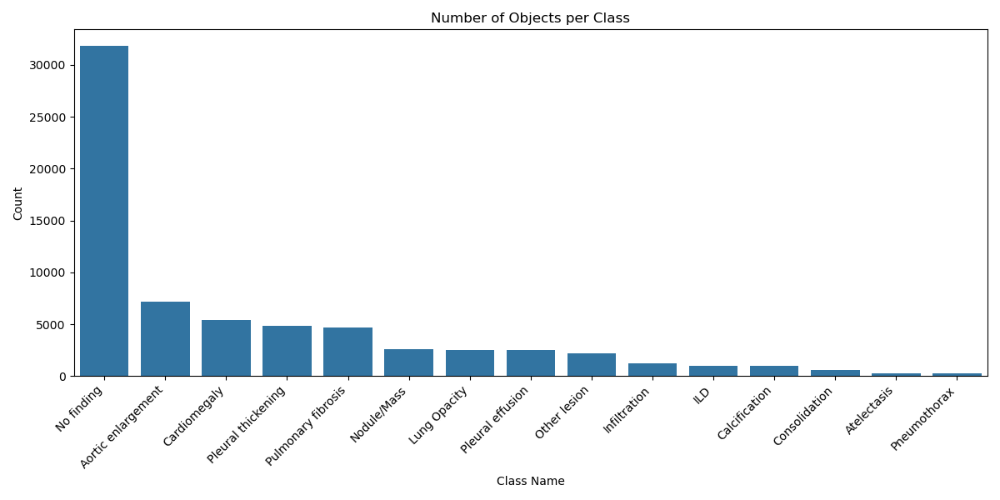
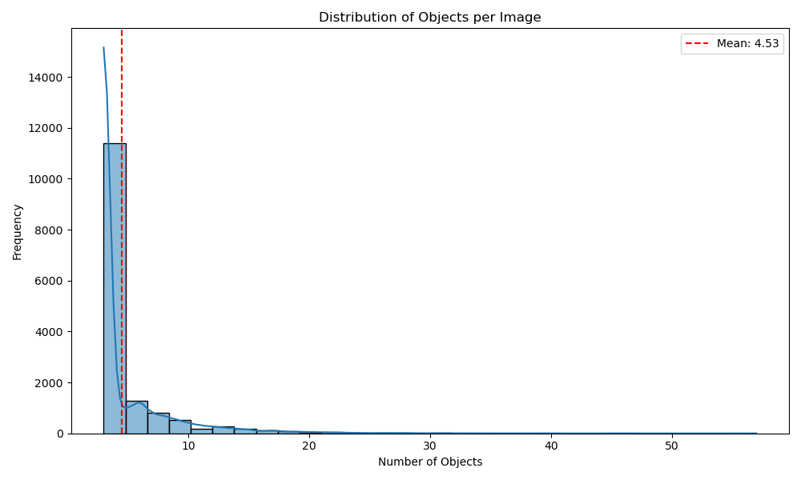
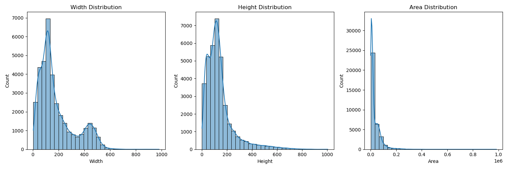
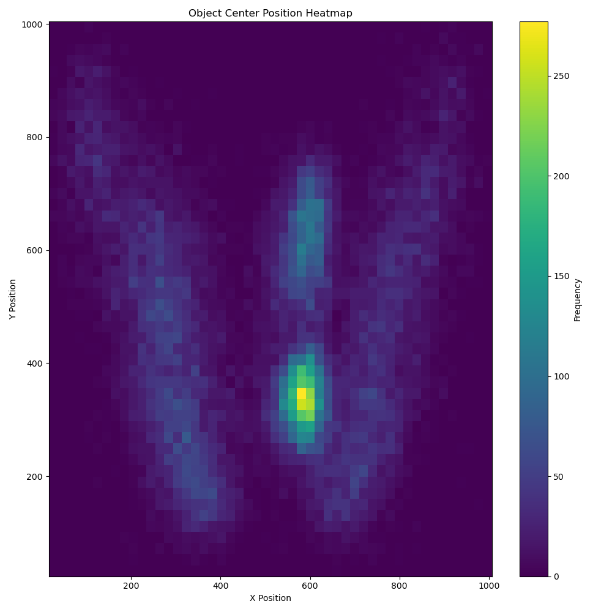
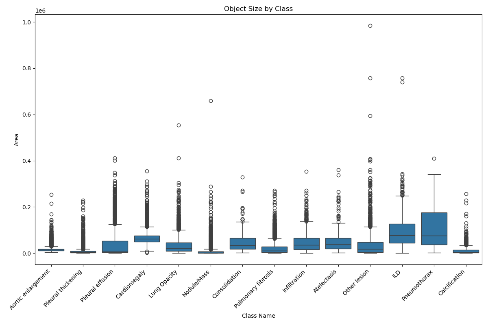
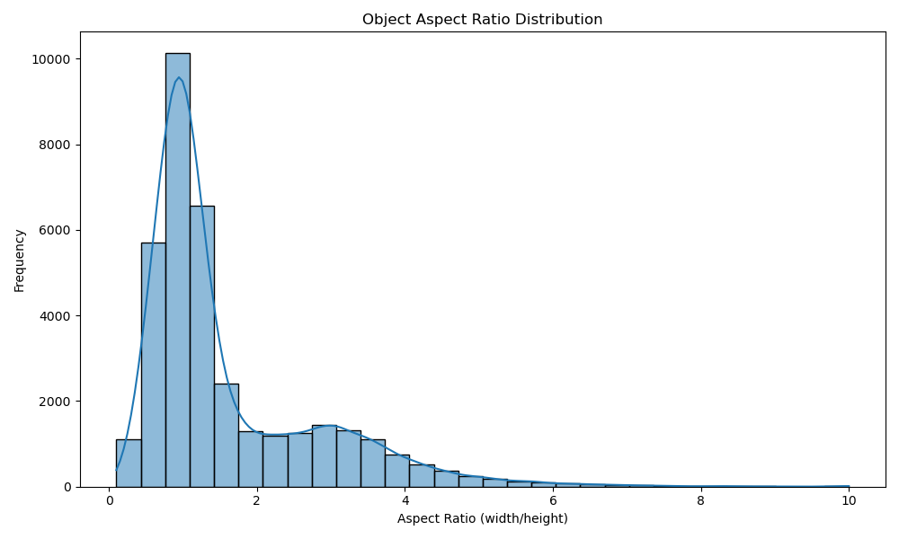

# Insight-Ray

AI-powered chest X-ray analysis system using YOLOv8 for automated detection of thoracic abnormalities.

## Overview

Insight-Ray is a deep learning application that analyzes chest X-ray images to detect and classify 14 different types of thoracic pathologies. The system combines YOLOv8 object detection with Google's Gemini AI to provide both visual detection and natural language explanations of findings.

## Dataset

This project uses the **VinBigData Chest X-ray Abnormalities Detection** dataset, which contains:
- Over 18,000 chest X-ray images
- 14 thoracic abnormality classes
- Bounding box annotations for localized findings

### Detected Classes
- Aortic enlargement
- Atelectasis
- Calcification
- Cardiomegaly
- Consolidation
- Edema
- Emphysema
- Fibrosis
- Infiltration
- Mass
- Nodule
- Pleural thickening
- Pneumothorax
- No finding

## Dataset Analysis

The project includes comprehensive data analysis with visualizations showing:

### Class Distribution


Distribution of abnormality types across the training dataset.

### Objects Per Image


Frequency of multiple findings appearing in single X-ray images.

### Size Distribution


Bounding box size analysis for detected abnormalities.

### Position Heatmap


Spatial distribution showing common locations of different pathologies.

### Class Size Comparison


Comparative analysis of typical abnormality sizes by class.

### Aspect Ratio Analysis


Distribution of bounding box aspect ratios across all classes.

## Project Structure

```
Insight-ray/
├── app.py                      # Flask web application with Gemini AI integration
├── interface.py                # Tkinter desktop interface for model inference
├── best.pt                     # Trained YOLOv8 model weights
├── DataProcess.ipynb           # Dataset analysis and preprocessing
├── Yolov8Tuning.ipynb         # Model training and hyperparameter tuning
├── makeValFolder.py           # Validation dataset preparation
├── check_models.py            # Gemini model availability checker
├── static/
│   └── index.html             # Web interface
├── analysis_results/          # Dataset visualization outputs
├── runs/                      # Training run results and metrics
├── TestImages/                # Sample X-ray images for testing
├── train.csv                  # Training annotations
└── val.csv                    # Validation annotations
```

## Features

### Flask Web Application (`app.py`)
A modern web-based interface featuring:
- **Image Upload & Analysis**: Drag-and-drop X-ray image upload with real-time processing
- **YOLOv8 Detection**: Automated abnormality detection with bounding boxes and confidence scores
- **AI Assistant**: Integrated Gemini 2.5 Flash model for:
  - Natural language explanations of detected findings
  - Medical terminology clarification
  - Interactive Q&A about analysis results
- **Visual Results**: Annotated images with detection overlays
- **Performance Metrics**: Inference time, confidence scores, and detection statistics

**Web Interface Preview:**
- Clean, minimalist dark gray UI
- Split-panel layout with results on left, AI chat on right
- Independent scrolling for results and chat sections
- Real-time detection visualization with bounding boxes

### Tkinter Desktop Interface (`interface.py`)
A simple desktop application that:
- Loads the trained YOLOv8 model (`best.pt`)
- Allows users to select and load X-ray images
- Displays inference results with bounding boxes directly on the image
- Shows detected classes and confidence scores
- No AI chat integration - purely for model inference visualization

## Installation

### Prerequisites
```bash
python >= 3.8
pip
```

### Dependencies
```bash
pip install -r requirements.txt
```

**Required packages:**
- flask
- flask-cors
- ultralytics (YOLOv8)
- opencv-python
- numpy
- google-generativeai
- tkinter (usually pre-installed with Python)

## Setup

### 1. Clone the Repository
```bash
git clone https://github.com/Adamkhald/InsightRay.git
cd InsightRay
```

### 2. Install Dependencies
```bash
pip install -r requirements.txt
```

### 3. Configure Gemini API
Create a `.env` file in the project root:
```env
GEMINI_API_KEY=your_gemini_api_key_here
```

Get your API key from [Google AI Studio](https://aistudio.google.com/app/apikey)

### 4. Verify Model File
Ensure `best.pt` is present in the project root (52MB trained model weights)

## Usage

### Web Application
```bash
python app.py
```
Access the interface at `http://localhost:5000`

### Desktop Application
```bash
python interface.py
```
- Click "Load Image" to select an X-ray
- Model automatically runs inference
- View results with bounding boxes on image

### Check Available Gemini Models
```bash
python check_models.py
```

## Model Training

Training notebooks are included:
- `DataProcess.ipynb`: Dataset preparation and analysis
- `Yolov8Tuning.ipynb`: Model training with hyperparameter optimization

Training results and metrics are saved in the `runs/` directory.

## API Endpoints

### POST `/predict`
Uploads and analyzes X-ray image
- **Input**: Form data with image file
- **Output**: JSON with detections, annotated image (base64), inference time

### POST `/chat`
Interacts with AI assistant
- **Input**: JSON with message and current detections
- **Output**: JSON with Gemini AI response

## Performance

- **Inference Time**: ~50-200ms per image (GPU dependent)
- **Model**: YOLOv8 fine-tuned on VinBigData dataset
- **Confidence Threshold**: 25% (configurable in `app.py`)

## Limitations

- This is a research/educational tool, not for clinical diagnosis
- All AI-generated findings should be verified by qualified healthcare professionals
- Model performance may vary on images outside the training distribution

## License

This project is for educational and research purposes. The VinBigData dataset has its own terms of use.

## Acknowledgments

- **VinBigData** for the chest X-ray dataset
- **Ultralytics** for YOLOv8
- **Google** for Gemini AI API

## Author

**Adam Khald**
- GitHub: [@Adamkhald](https://github.com/Adamkhald)

## Contributing

Contributions are welcome! Please open an issue or submit a pull request.

---

**Note**: The model file (`best.pt`) is large (52MB). If you encounter issues cloning, consider using Git LFS or downloading it separately.